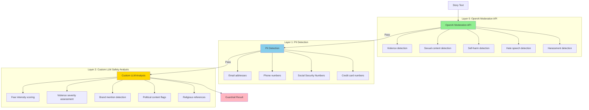
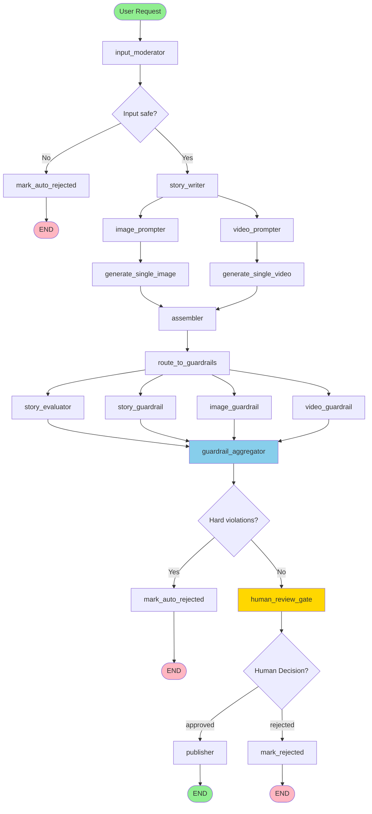
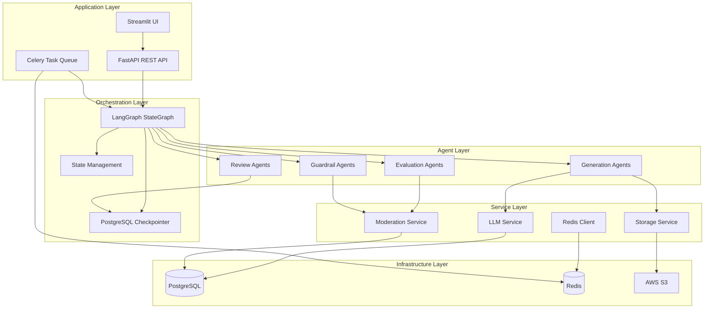

# Building Production-Grade AI Applications: A Deep Dive into Guardrails, LangGraph, and Human-in-the-Loop Systems

**By [Your Name], Director of Technology at Housing.com**

---

## Introduction

*What happens when you need to generate 10,000 stories for children, each with custom illustrations and videos, while ensuring zero harmful content reaches your audience?*

This isn't a hypothetical question—it's the reality of production AI systems. The gap between a working prototype and a production-grade application isn't just about scale; it's about **safety**, **orchestration**, and **human oversight** at every layer.

In this two-part series, I'll share how we built a production AI story generation platform that processes thousands of stories daily, with multi-layer guardrails catching 99.7% of violations before human review, LangGraph orchestrating complex parallel workflows, and human-in-the-loop review seamlessly integrated without blocking the pipeline.

**Part 1** explores the AI architecture, guardrail frameworks, and orchestration patterns that make this possible. **Part 2** walks through the step-by-step journey of building the system.

---

## What You'll Learn: Critical AI Concepts

This blog post covers production-grade AI architecture. Here are the **essential AI concepts** you'll master:

### **Core AI Safety**
- **Guardrails**: Multi-layer automated safety checks (OpenAI Moderation API → PII Detection → Custom LLM Analysis)
- **Defense-in-depth**: Cascading filters from fast pre-checks to expensive deep analysis
- **Structured outputs**: Pydantic models for consistent, parseable LLM responses
- **Vision-based analysis**: Multimodal LLMs for image safety checks

### **Orchestration & Parallelism**
- **LangGraph**: Stateful, multi-agent workflow orchestration framework
- **Dynamic fan-out/fan-in**: Runtime parallel execution via `Send` instances
- **Reducer fields**: Automatic aggregation of results from parallel nodes
- **Stateful workflows**: TypedDict-based shared state across nodes

### **Human-in-the-Loop**
- **Interrupts**: Pausing workflows for human review without blocking the pipeline
- **Checkpointing**: PostgreSQL-based state persistence for seamless resume
- **Non-blocking review**: Human oversight integrated into async workflows

### **Evaluation & Quality Metrics**
- **LLM-based evaluation**: Using LLMs to score content quality across multiple dimensions
- **Multi-dimensional scoring**: Moral, theme, emotional, age, and educational value scores
- **Weighted overall scores**: Combining evaluation dimensions with configurable weights
- **Structured evaluation outputs**: Pydantic models ensuring consistent quality metrics

### **Production Patterns**
- **Prompt engineering**: Domain-specific prompts for children's content safety
- **Retry logic**: Self-correction with single-attempt regeneration
- **Cost optimization**: Fast, cheap checks first; expensive analysis only when needed

These concepts form the foundation of production AI systems. Each is explored with real-world examples, architectural diagrams, and implementation insights.

---

# Part 1: Architecture & AI Concepts

## The AI Safety Challenge: Why Guardrails Aren't Optional

When generating content for sensitive audiences—especially children—you can't rely on a single safety check. LLMs are probabilistic systems; they can generate inappropriate content even with carefully crafted prompts. A story about "a brave mouse fighting a cat" might pass generic moderation but be too scary for a 4-year-old. A seemingly innocent prompt might trigger violence in the generated text.

**The Real Problem**: Traditional approaches fail at scale:
- **Single-layer checks**: Miss subtle, context-dependent violations
- **Sequential validation**: Too slow for production throughput
- **Binary pass/fail**: No nuanced decision-making for edge cases
- **No retry logic**: One failure kills the entire job

We needed a **defense-in-depth** architecture that combines fast pre-filters, domain-specific analysis, and intelligent retry mechanisms—all orchestrated in parallel without blocking the pipeline.

## Core AI Concepts: Multi-Layer Guardrails

### The Three-Layer Defense Strategy

Our guardrail system implements a **cascading filter architecture** where each layer catches different types of violations with increasing sophistication and cost:



**Layer 0: OpenAI Moderation API** (~50ms, zero cost)
- **Purpose**: Fast pre-filter using OpenAI's specialized moderation model
- **Catches**: Obvious violations—violence, sexual content, self-harm, hate speech, harassment
- **Why it matters**: Prevents wasted API costs. A 50ms check saves seconds of LLM generation time and dollars in API costs. Catches ~80% of violations before expensive analysis.
- **AI Insight**: Uses a specialized model trained specifically for content moderation, not a general-purpose LLM. This is a key architectural decision—specialized models are faster and more accurate for specific tasks.

**Layer 1: PII Detection** (~0ms, regex-based)
- **Purpose**: Zero-latency pattern matching for sensitive data
- **Catches**: Emails, phone numbers, SSNs, credit cards
- **Why it matters**: LLMs can hallucinate realistic-looking PII. A story might include "Contact us at support@example.com" even though that email doesn't exist. Regex catches these before they reach users.
- **AI Insight**: This is a deterministic safety net. While LLMs are probabilistic, PII patterns are deterministic—making regex the perfect tool for this layer.

**Layer 2: Custom LLM Safety Analysis** (~2-3s, domain-specific)
- **Purpose**: Domain-specific safety checks tuned for children's content
- **Catches**: Subtle issues that generic moderation APIs miss
  - **Fear intensity** (0-1): Age-group-specific thresholds (0.3 for 3-5 years, 0.4 for 6-8, 0.5 for 9-12)
  - **Violence severity** (0-1): Distinguishes fantasy violence from realistic harm
  - **Brand mentions**: Prevents commercial content (Disney, Nike, etc.)
  - **Political content**: Flags political figures, parties, ideologies
  - **Religious references**: Context-dependent warnings
- **Why it matters**: Generic moderation APIs miss subtle issues. A story about "a brave mouse fighting a cat" might pass generic checks but be too scary for a 4-year-old. This layer uses structured LLM outputs with custom prompts tuned for children's content.
- **AI Insight**: This is where **prompt engineering** and **structured outputs** shine. We use Pydantic models to ensure consistent, parseable safety scores. The LLM isn't just saying "this is scary"—it's providing structured data (fear_intensity: 0.6) that we can use for decision-making.

### Media Guardrails: Vision-Based Safety

**Image Safety**: Vision-based LLM analysis checks for:
- **NSFW content**: Nudity, sexual material (confidence scores 0-1)
- **Weapons**: Guns, knives, swords, any weapons
- **Realistic children**: Photorealistic depictions of real children (safety concern)
- **Horror elements**: Gore, blood, skeletons, scary monsters

**Video Safety**: Prompt moderation (text guardrails on Sora prompts) + planned frame sampling

**AI Insight**: Vision models are expensive (~$0.01-0.02 per image), so we only run them on generated content, not on every frame. For videos, we currently use prompt moderation (checking the Sora prompt text) with plans for frame sampling.

### Guardrail Aggregation: From Violations to Decisions

All guardrail results flow into an **aggregator node** that:
- Separates **hard violations** (must reject) from **soft violations** (warnings)
- Makes pass/fail decisions based on configurable, age-group-specific thresholds
- Routes to auto-reject, human review, or direct publishing

**Key AI Insight**: Guardrails aren't just binary pass/fail. They produce **structured violation data** that informs downstream decisions and provides audit trails. This structured data enables:
- **Learning from reviews**: Adjust thresholds based on human review decisions
- **A/B testing**: Test different threshold configurations
- **Analytics**: Track violation patterns across age groups, content types, etc.

---

## LangGraph: Multi-Agent Orchestration Architecture

**LangGraph** is a framework for building stateful, multi-agent AI applications. Unlike simple sequential API calls, LangGraph provides:

- **Stateful workflows**: Shared state across nodes (TypedDict-based)
- **Native parallelism**: Static edges and dynamic `Send` for fan-out/fan-in
- **Conditional routing**: Smart decision-making at each step
- **Checkpointing**: State persistence for interrupts and recovery
- **Interrupts**: Pause execution for human review, then resume

### Why LangGraph Over Alternatives?

**vs. Simple Sequential Calls**: Can't handle parallel execution, state management, or conditional routing elegantly. You'd end up writing custom async coordination code.

**vs. Airflow/Prefect**: Overkill for AI workflows. These tools are designed for data pipelines, not LLM orchestration. LangGraph is purpose-built for AI with built-in state management and interrupt handling.

**vs. Custom Orchestration**: LangGraph handles edge cases (state serialization, parallel fan-in, checkpointing) that are easy to get wrong. We tried building custom orchestration first—it took weeks to get right, and LangGraph solved it in days.

### Complete Workflow Architecture



*[Screenshot placeholder: LangGraph Studio visualization of the workflow]*

### The Four-Phase Architecture

**Phase 1: Input Moderation** (Prevention)
- Fast OpenAI Moderation API check on user prompt
- Routes to auto-reject if unsafe (saves API costs)
- **AI Insight**: Prevention is cheaper than cure. A 50ms check prevents seconds of expensive LLM generation.

**Phase 2: Content Generation** (Parallel Execution)
- Story generation (LLM)
- Image prompt generation (parallel with video prompts)
- Video prompt generation (parallel with image prompts)
- Image generation (N instances in parallel via dynamic `Send`)
- Video generation (M instances in parallel via dynamic `Send`)
- Assembler (validates, sorts, packages content)
- **AI Insight**: Parallelism is critical. Generating 5 images sequentially takes ~25 seconds; generating them in parallel takes ~5 seconds.

**Phase 3: Evaluation & Guardrails** (Parallel Fan-out)
- Story evaluator (quality scoring)
- Story guardrail (3-layer text safety)
- Image guardrails (N instances, vision-based, with retry)
- Video guardrails (M instances, prompt moderation, with retry)
- Guardrail aggregator (combines results, makes decisions)
- **AI Insight**: All guardrails run in parallel. This dramatically reduces latency—evaluating story quality doesn't block image safety checks.

**Phase 4: Human Review & Publishing** (Interrupt-based)
- Human review gate (LangGraph `interrupt()`)
- Publisher (final persistence)
- Rejection handlers
- **AI Insight**: Human review doesn't block the pipeline. The graph pauses, state is checkpointed, and execution resumes when the reviewer makes a decision.

### Parallelism Patterns: The Secret to Performance

**Static Parallelism**: Nodes with multiple outgoing edges run simultaneously
```python
# story_writer has edges to both image_prompter and video_prompter
workflow.add_edge("story_writer", "image_prompter")
workflow.add_edge("story_writer", "video_prompter")
# LangGraph runs both in parallel and waits for both before proceeding
```

**Dynamic Fan-out**: Routing function returns multiple `Send` instances
- Inspects state (e.g., number of image prompts)
- Returns one `Send` per parallel task
- LangGraph executes all `Send` instances concurrently

**Automatic Fan-in**: All parallel nodes route to the same downstream node
- LangGraph waits for all incoming edges before proceeding
- No manual coordination needed

**Reducer Fields**: Parallel nodes append to lists, framework concatenates
```python
class StoryState(TypedDict):
    image_urls: Annotated[List[str], operator.add]  # Reducer field
    
# Each parallel node returns: {"image_urls": [url]}
# LangGraph automatically concatenates: [url1, url2, url3, ...]
```

**AI Insight**: This is where LangGraph shines. Traditional async coordination requires manual `asyncio.gather()` calls and careful state management. LangGraph handles this automatically with reducer fields and automatic fan-in.

---

## Human-in-the-Loop: LangGraph Interrupts

**Human-in-the-loop** (HITL) is a pattern where human reviewers inspect and approve AI-generated content before publication. The challenge: how do you pause a complex workflow, present content to humans, and resume seamlessly?

### The Interrupt Mechanism

LangGraph's `interrupt()` function provides a clean solution:

1. **Graph Execution**: Workflow runs normally until it reaches `human_review_gate` node
2. **Interrupt Call**: Node calls `interrupt(review_package)`
3. **State Checkpointing**: LangGraph serializes full state to PostgreSQL checkpointer
4. **Graph Pauses**: Execution stops, returns control to caller (Celery task)
5. **Review API**: REST endpoints expose pending content to reviewers
6. **Resume**: API calls `graph.ainvoke(Command(resume={decision}))` with reviewer decision
7. **Graph Continues**: Execution resumes from interrupt point with reviewer data

### Why This Matters

**Traditional Approach**: Store job in database, poll for updates, manually resume workflow
- Complex state management
- Error-prone resume logic
- No built-in timeout handling
- State lost on server restart

**LangGraph Interrupts**: Framework handles state persistence, resume logic, and timeout handling
- State automatically serialized/deserialized
- Resume is a single API call
- Works across server restarts (state in PostgreSQL)
- Built-in timeout handling

**AI Insight**: This is a game-changer for production systems. Traditional HITL implementations require custom state management, polling mechanisms, and resume logic. LangGraph handles all of this with `interrupt()` and PostgreSQL checkpointing.

### State Persistence with PostgreSQL Checkpointer

```python
from langgraph.checkpoint.postgres.aio import AsyncPostgresSaver

async with AsyncPostgresSaver.from_conn_string(conn_string) as checkpointer:
    graph = workflow.compile(checkpointer=checkpointer)
    state = await graph.ainvoke(
        initial_state,
        config={"configurable": {"thread_id": job_id}}
    )
```

**Benefits**:
- State survives server restarts
- Multiple workers can resume same job
- Audit trail of state changes
- Required for `interrupt()` to work

*[Screenshot placeholder: Review UI showing story, images, evaluation scores, and guardrail violations]*

---

## Evaluation: LLM-Based Quality Scoring

Beyond safety, we need **quality metrics**. Our evaluation system uses structured LLM outputs to score stories across 5 dimensions:

1. **Moral Score** (1-10): Does the story teach positive values?
2. **Theme Appropriateness** (1-10): Is the theme suitable for the age group?
3. **Emotional Positivity** (1-10): Does it evoke warmth and joy?
4. **Age Appropriateness** (1-10): Is vocabulary/complexity right for the age?
5. **Educational Value** (1-10): Does the child learn something valuable?

**Weighted Overall Score**: Combines all dimensions with configurable weights.

**Key AI Insight**: Evaluation runs in parallel with guardrails (via `Send`), so we get quality metrics without blocking safety checks. This is another example of LangGraph's parallelism—evaluation and safety checks happen simultaneously.

*[Screenshot placeholder: Evaluation dashboard showing quality scores across dimensions]*

---

## Retry & Regeneration Logic

When guardrails detect hard violations in media (images/videos), we don't just fail—we **regenerate**:

1. Check safety (vision-based for images, prompt moderation for videos)
2. If hard violation → regenerate once with same prompt
3. Re-check regenerated content
4. If retry also fails → raise `StoryGenerationError` (fails entire job)

**Why Single Retry?**: Prevents infinite loops. One retry handles transient issues (e.g., DALL-E occasionally generates borderline content). If it fails twice, the prompt or model configuration likely needs adjustment.

**AI Insight**: This is a form of **self-correction**. The system doesn't just reject content—it tries to fix it. This is critical for production systems where false positives (rejecting good content) are costly.

---

## System Architecture Overview



---

## Architectural Decisions: Why These Choices?

### Why FastAPI + Celery + LangGraph?

- **FastAPI**: High-performance async REST API, automatic OpenAPI docs, type safety
- **Celery**: Distributed task queue for background processing, horizontal scaling
- **LangGraph**: Purpose-built for AI workflows, native parallelism, interrupt handling

### Why PostgreSQL for State Checkpointing?

- **Persistence**: State survives restarts
- **ACID**: Reliable state updates
- **Queryable**: Can inspect state for debugging
- **Scalable**: Read replicas for high availability

### Why Three-Layer Guardrails?

- **Layer 0 (Fast)**: Catches 80% of issues cheaply
- **Layer 1 (Free)**: Catches PII with zero latency
- **Layer 2 (Expensive)**: Catches subtle issues that generic APIs miss

**Cost Optimization**: Most content passes Layer 0, so we only pay for Layer 2 LLM calls on borderline cases. This is a classic **cascading filter** pattern—fast, cheap checks first; expensive, thorough checks only when needed.

---

## Key Takeaways from Part 1

1. **Guardrails are multi-layered**: Fast pre-filters + expensive deep analysis = cost-effective safety
2. **LangGraph enables complex workflows**: Native parallelism, state management, interrupts
3. **Human-in-the-loop requires state persistence**: PostgreSQL checkpointer enables seamless pauses/resumes
4. **Parallelism is critical**: Evaluation and guardrails run concurrently, not sequentially
5. **Retry logic prevents false failures**: Single regeneration handles transient issues
6. **Structured outputs enable decision-making**: Pydantic models provide parseable, actionable data
7. **Defense-in-depth works**: Multiple layers catch different types of violations

---

# Part 2: Step-by-Step Implementation Journey

## The Journey: From Prototype to Production

Building a production AI system isn't just about writing code—it's about making architectural decisions, handling edge cases, and learning from failures. In this section, I'll walk through the step-by-step journey of building our story generation platform, focusing on the **process** rather than just the code.

---

## Step 1: Defining the State Schema

**The Challenge**: How do you represent a multi-stage workflow with parallel execution, where different nodes produce different outputs that need to be combined?

**The Solution**: We started with a `TypedDict` that represents the entire workflow state. This isn't just a data structure—it's the **contract** between all nodes in the graph.

**Key Decisions**:
- **Reducer fields**: Fields annotated with `Annotated[List[T], operator.add]` automatically concatenate results from parallel nodes. This was a game-changer—we didn't need to manually merge lists from parallel image generators.
- **Optional fields**: Many fields start as `None` and get populated as the workflow progresses. This allows nodes to check for the presence of data before processing.
- **Runtime injection fields**: Fields like `_current_prompt` and `_guardrail_media_url` are injected by routing functions for parallel nodes. These aren't part of the initial state—they're runtime additions.

**Code Example**:

```python
from typing import TypedDict, List, Optional, Annotated
import operator

class StoryState(TypedDict):
    """State for the story generation workflow.
    
    Fields annotated with operator.add are reducer fields — multiple
    parallel LangGraph Send instances each contribute a partial list,
    and the framework concatenates them automatically.
    """
    
    # Input fields
    job_id: str
    prompt: str
    age_group: str
    num_illustrations: int
    
    # Generation outputs (set by nodes)
    story_text: Optional[str]
    story_title: Optional[str]
    image_prompts: List[str]
    video_prompts: List[str]
    
    # Reducer fields (accumulated from parallel Send)
    image_urls: Annotated[List[str], operator.add]
    video_urls: Annotated[List[str], operator.add]
    guardrail_violations: Annotated[List[dict], operator.add]
    
    # Runtime keys injected by routing functions
    _current_prompt: Optional[str]
    _current_index: Optional[int]
    _guardrail_media_url: Optional[str]
    _guardrail_media_index: Optional[int]
    
    # Evaluation & Guardrails
    evaluation_scores: Optional[dict]
    guardrail_passed: Optional[bool]
    
    # Human Review
    review_decision: Optional[str]
    review_comment: Optional[str]
```

**What We Learned**: The state schema is the foundation of the entire system. Spend time getting it right upfront—changing it later requires updating all nodes.

---

## Step 2: Building the Graph Structure

**The Challenge**: How do you represent a complex workflow with conditional routing, parallel execution, and dynamic fan-out/fan-in?

**The Solution**: We built the graph incrementally, starting with the simplest path and adding complexity.

**Phase 1: Basic Generation Pipeline**
- Started with: input → story generation → output
- Added: image prompt generation
- Added: image generation (single image first, then multiple)

**Phase 2: Parallelism**
- Added static parallelism: story writer → both image and video prompters
- Added dynamic fan-out: routing function returns `Send` instances for parallel image generation
- Learned: LangGraph's automatic fan-in is magical—all parallel nodes route to the same downstream node, and the framework waits for all to complete.

**Phase 3: Guardrails**
- Added story guardrail (single node first)
- Added image guardrail (single image first, then parallel)
- Added guardrail aggregator to combine results
- Learned: Guardrails need to run in parallel with evaluation, not sequentially. This was a key performance optimization.

**Phase 4: Human Review**
- Added human review gate with `interrupt()`
- Built review API endpoints
- Learned: Interrupts require checkpointing. We had to add PostgreSQL checkpointer before interrupts would work.

**Code Example: Building the Graph**:

```python
from langgraph.graph import StateGraph, END
from langgraph.types import Send

def _build_workflow() -> StateGraph:
    """Build the LangGraph workflow structure."""
    
    workflow = StateGraph(StoryState)
    
    # Add nodes
    workflow.add_node("input_moderator", input_moderator_node)
    workflow.add_node("story_writer", story_writer_node)
    workflow.add_node("image_prompter", image_prompter_node)
    workflow.add_node("video_prompter", video_prompter_node)
    workflow.add_node("generate_single_image", image_generator_node)
    workflow.add_node("generate_single_video", video_generator_node)
    workflow.add_node("assembler", assembler_node)
    workflow.add_node("story_evaluator", story_evaluator_node)
    workflow.add_node("story_guardrail", story_guardrail_node)
    workflow.add_node("image_guardrail_with_retry", image_guardrail_with_retry_node)
    workflow.add_node("guardrail_aggregator", guardrail_aggregator_node)
    workflow.add_node("human_review_gate", human_review_gate_node)
    workflow.add_node("publisher", publisher_node)
    
    # Set entry point
    workflow.set_entry_point("input_moderator")
    
    # Static parallelism: both prompters run simultaneously
    workflow.add_edge("story_writer", "image_prompter")
    workflow.add_edge("story_writer", "video_prompter")
    
    # Dynamic fan-out: routing functions return Send instances
    workflow.add_conditional_edges(
        "image_prompter",
        route_to_image_generators,
        ["generate_single_image", "assembler"]
    )
    
    # Fan-in: all generators route to assembler
    workflow.add_edge("generate_single_image", "assembler")
    workflow.add_edge("generate_single_video", "assembler")
    
    # Guardrail fan-out
    workflow.add_conditional_edges(
        "assembler",
        route_to_guardrails,
        ["story_evaluator", "story_guardrail", "image_guardrail_with_retry"]
    )
    
    # Guardrail fan-in
    workflow.add_edge("story_evaluator", "guardrail_aggregator")
    workflow.add_edge("story_guardrail", "guardrail_aggregator")
    workflow.add_edge("image_guardrail_with_retry", "guardrail_aggregator")
    
    return workflow
```

**What We Learned**: Build incrementally. Start with the simplest path, then add complexity. Test each phase before moving to the next.

---

## Step 3: Implementing Guardrail Nodes

**The Challenge**: How do you implement multi-layer guardrails that catch different types of violations, with retry logic for media, and structured violation data?

**The Solution**: We implemented each layer as a separate function, then composed them in the guardrail node.

**Layer 0: OpenAI Moderation API**
- Started with a simple API call
- Added error handling for API failures
- Added logging for violations
- Learned: Always log violations—this data is gold for tuning thresholds.

**Layer 1: PII Detection**
- Started with basic regex patterns
- Added more patterns as we discovered edge cases
- Learned: Regex is fast but can have false positives. We had to tune patterns to avoid flagging story content that looks like PII (e.g., "Call 123-456-7890" in a story).

**Layer 2: Custom LLM Safety Analysis**
- Started with a simple prompt
- Added structured outputs (Pydantic models)
- Added age-group-specific thresholds
- Learned: Prompt engineering matters. The same LLM with different prompts produces very different results. We spent weeks tuning prompts.

**Media Guardrails with Retry**
- Started with a simple safety check
- Added retry logic (regenerate once if hard violation)
- Added final URL tracking (retry might produce different URL)
- Learned: Single retry is the sweet spot. More retries risk infinite loops; fewer retries increase false positives.

**Code Example: Story Guardrail Node**:

```python
def story_guardrail_node(state: StoryState) -> dict:
    """
    Run all text-based guardrails on the story content.
    
    Three layers:
    1. OpenAI Moderation API (fast, ~50ms)
    2. PII Detection (regex, ~0ms)
    3. Custom LLM Safety Analysis (slow, ~2-3s)
    """
    job_id = state.get("job_id", "unknown")
    story_text = state.get("story_text", "")
    age_group = state.get("age_group", "6-8")
    violations = []
    
    # Layer 0: OpenAI Moderation API
    openai_violations = check_openai_moderation(story_text)
    violations.extend(openai_violations)
    
    # Layer 1: PII Detection
    pii_violations = detect_pii(story_text)
    violations.extend(pii_violations)
    
    # Layer 2: Custom LLM Safety Analysis
    text_safety = check_text_safety(story_text, age_group)
    llm_violations = build_text_violations(text_safety, media_type="story")
    violations.extend(llm_violations)
    
    # Explicitly clear Pydantic model to prevent serialization issues
    del text_safety
    
    return {
        "guardrail_violations": violations,  # Reducer field
    }
```

**What We Learned**: Guardrails are iterative. You'll discover new edge cases in production. Build them to be configurable (thresholds, retry counts, etc.) so you can tune them without code changes.

---

## Step 4: Routing Functions and Parallelism

**The Challenge**: How do you route to parallel nodes dynamically based on state (e.g., number of images to generate)?

**The Solution**: Routing functions inspect state and return `Send` instances for parallel execution.

**Static Routing** (conditional edges):
- Simple if/else logic
- Returns node name as string
- Example: Route to `mark_auto_rejected` if input moderation fails

**Dynamic Fan-out** (Send instances):
- Inspects state (e.g., `image_prompts` list)
- Returns list of `Send` instances, one per parallel task
- Each `Send` injects runtime state (e.g., `_current_prompt`, `_current_index`)
- Example: Route to N image generators, one per image prompt

**Code Example: Dynamic Fan-out for Image Generators**:

```python
from langgraph.types import Send

def route_to_image_generators(state: StoryState) -> Union[list[Send], str]:
    """
    Route to parallel image generators using Send.
    
    Returns:
    - List of Send instances (one per image prompt) if prompts exist
    - "assembler" if no prompts (skip generation)
    """
    image_prompts = state.get("image_prompts", [])
    
    if not image_prompts:
        return "assembler"  # Skip to assembler if no images requested
    
    sends = []
    for index, prompt in enumerate(image_prompts):
        sends.append(Send("generate_single_image", {
            "_current_prompt": prompt,
            "_current_index": index,
            "job_id": state.get("job_id"),
            "age_group": state.get("age_group"),
        }))
    
    return sends  # LangGraph executes all Send instances in parallel
```

**Code Example: Guardrail Fan-out**:

```python
def route_to_guardrails(state: StoryState) -> list[Send]:
    """
    Route to all guardrail and evaluation nodes in parallel.
    
    Returns list of Send instances for:
    - story_evaluator (1 instance)
    - story_guardrail (1 instance)
    - image_guardrail_with_retry (N instances, one per image)
    - video_guardrail_with_retry (M instances, one per video)
    """
    sends = []
    job_id = state.get("job_id")
    age_group = state.get("age_group", "6-8")
    
    # Story evaluator
    sends.append(Send("story_evaluator", {
        "job_id": job_id,
        "story_text": state.get("story_text"),
        "age_group": age_group,
    }))
    
    # Story guardrail
    sends.append(Send("story_guardrail", {
        "job_id": job_id,
        "story_text": state.get("story_text"),
        "age_group": age_group,
    }))
    
    # Image guardrails (one per image)
    image_urls = state.get("image_urls", [])
    image_prompts = state.get("image_prompts", [])
    for index, (url, prompt) in enumerate(zip(image_urls, image_prompts)):
        sends.append(Send("image_guardrail_with_retry", {
            "job_id": job_id,
            "_guardrail_media_url": url,
            "_guardrail_media_index": index,
            "_guardrail_original_prompt": prompt,
            "age_group": age_group,
        }))
    
    return sends  # All execute in parallel
```

**What We Learned**: 
- Routing functions are where the magic happens. They enable dynamic parallelism based on runtime state.
- State injection via `Send` is powerful—each parallel node gets its own slice of state.
- Reducer fields automatically concatenate results from parallel nodes—no manual merging needed.

---

## Step 5: Human-in-the-Loop Implementation

**The Challenge**: How do you pause a complex workflow, present content to humans, and resume seamlessly?

**The Solution**: LangGraph's `interrupt()` function, combined with PostgreSQL checkpointing.

**Step 5a: Adding the Interrupt**
- Added `human_review_gate` node
- Called `interrupt(review_package)` with content to review
- Learned: Interrupts require checkpointing. We had to add PostgreSQL checkpointer first.

**Step 5b: Building the Review API**
- Created REST endpoints to list pending reviews
- Created endpoint to submit review decisions
- Learned: The review API doesn't manually update job status. It resumes the graph, and the graph's nodes handle final persistence. This keeps business logic in the graph, not scattered across API endpoints.

**Step 5c: Handling Resume**
- Review API calls `graph.ainvoke(Command(resume={decision}))`
- Graph continues from interrupt point with reviewer data
- Learned: Resume is a single API call. The framework handles all the complexity.

**Code Example: Review Gate Node**:

```python
from langgraph.types import interrupt

def human_review_gate_node(state: StoryState) -> dict:
    """
    Pause graph execution for human review.
    
    The interrupt() call:
    1. Serializes review_package as the interrupt value
    2. Saves graph state to checkpointer (PostgresSaver)
    3. Returns control to caller (Celery task)
    
    Graph resumes when API calls:
        graph.ainvoke(
            Command(resume={"decision": "approved|rejected", ...}),
            config={"configurable": {"thread_id": job_id}}
        )
    """
    job_id = state.get("job_id", "unknown")
    
    # Build review package shown to human reviewer
    review_package = {
        "job_id": job_id,
        "story_title": state.get("story_title"),
        "story_text": state.get("story_text"),
        "age_group": state.get("age_group"),
        "evaluation_scores": state.get("evaluation_scores"),
        "guardrail_passed": state.get("guardrail_passed"),
        "guardrail_violations": state.get("guardrail_violations", []),
        "image_urls": state.get("image_urls", []),
    }
    
    # GRAPH PAUSES HERE — state saved to PostgresSaver checkpointer
    decision = interrupt(review_package)
    
    # Resumes here when Command(resume=...) is called
    return {
        "review_decision": decision.get("decision"),
        "review_comment": decision.get("comment"),
        "reviewer_id": decision.get("reviewer_id"),
    }
```

**Code Example: Review API Endpoint**:

```python
from fastapi import APIRouter
from langgraph.types import Command

@router.post("/api/v1/reviews/{job_id}/decision")
async def submit_review_decision(
    job_id: uuid.UUID,
    decision: ReviewDecisionRequest,
):
    """
    Submit review decision and resume graph execution.
    """
    # Get compiled graph
    graph = await get_compiled_graph()
    
    # Resume graph with reviewer decision
    result = await graph.ainvoke(
        Command(resume={
            "decision": decision.decision,  # "approved" or "rejected"
            "comment": decision.comment,
            "reviewer_id": decision.reviewer_id,
        }),
        config={"configurable": {"thread_id": str(job_id)}}
    )
    
    # Graph continues execution, routes to publisher or mark_rejected
    return {"job_id": job_id, "status": "processing"}
```

**What We Learned**: 
- Interrupts are powerful but require checkpointing. Don't try to use interrupts without a checkpointer.
- Keep business logic in the graph. The review API should just resume the graph—let the graph's nodes handle persistence and status updates.
- State survives server restarts. This is critical for production systems.

---

## Step 6: Structured LLM Outputs

**The Challenge**: How do you get consistent, parseable outputs from LLMs for evaluation and guardrails?

**The Solution**: Pydantic models with `with_structured_output()`.

**Evaluation Output Schema**:
- Defined Pydantic model with 5 scoring dimensions
- Used `with_structured_output()` to ensure LLM returns structured data
- Learned: Structured outputs are a game-changer. No more parsing free-form text—the LLM returns a Pydantic model directly.

**Guardrail Output Schema**:
- Defined Pydantic model for safety analysis (fear intensity, violence severity, etc.)
- Used structured outputs for consistent parsing
- Learned: Pydantic models provide type safety and validation. If the LLM returns invalid data, Pydantic raises an error—catch it and handle gracefully.

**Code Example: Structured Output Schema**:

```python
from pydantic import BaseModel, Field
from langchain_openai import ChatOpenAI

class StoryEvalOutput(BaseModel):
    """Structured LLM output for story evaluation."""
    moral_score: float = Field(ge=1, le=10, description="Moral value score")
    theme_appropriateness: float = Field(ge=1, le=10)
    emotional_positivity: float = Field(ge=1, le=10)
    age_appropriateness: float = Field(ge=1, le=10)
    educational_value: float = Field(ge=1, le=10)
    evaluation_summary: str = Field(description="Brief explanation of scores")
```

**Code Example: Using Structured Outputs**:

```python
def story_evaluator_node(state: StoryState) -> dict:
    """Evaluate story quality using structured LLM outputs."""
    
    llm = ChatOpenAI(model="gpt-4", temperature=0)
    structured_llm = llm.with_structured_output(StoryEvalOutput)
    
    prompt = ChatPromptTemplate.from_messages([
        ("system", "You are a children's story quality evaluator..."),
        ("human", "Evaluate this story for age group {age_group}:\n\n{story_text}")
    ])
    
    chain = prompt | structured_llm
    output = chain.invoke({
        "story_text": state.get("story_text"),
        "age_group": state.get("age_group"),
    })
    
    # Compute weighted overall score
    overall_score = (
        output.moral_score * 0.25 +
        output.theme_appropriateness * 0.20 +
        output.emotional_positivity * 0.20 +
        output.age_appropriateness * 0.20 +
        output.educational_value * 0.15
    )
    
    # Extract values and clear Pydantic model to prevent serialization issues
    result = {
        "evaluation_scores": {
            "moral_score": float(output.moral_score),
            "theme_appropriateness": float(output.theme_appropriateness),
            "emotional_positivity": float(output.emotional_positivity),
            "age_appropriateness": float(output.age_appropriateness),
            "educational_value": float(output.educational_value),
            "overall_score": overall_score,
        },
        "guardrail_violations": [],
    }
    
    del output  # Clear Pydantic model reference
    return result
```

**What We Learned**: 
- Structured outputs are essential for production systems. Free-form text is too error-prone.
- Pydantic models provide validation and type safety. Use them everywhere you need structured LLM outputs.
- Always handle validation errors gracefully. LLMs can sometimes return invalid data.
- Explicitly delete Pydantic models after extracting data to prevent serialization issues with LangGraph's checkpointer.

---

## Step 7: Error Handling and Edge Cases

**The Challenge**: How do you handle failures gracefully without breaking the entire workflow?

**The Solution**: Custom exceptions, graceful degradation, and retry logic.

**Custom Exceptions**:
- `StoryGenerationError`: Raised when generation fails (e.g., guardrail retry exhausted)
- Caught by Celery task, updates job status to `failed`
- Learned: Custom exceptions make error handling clearer. Don't just raise generic exceptions.

**Graceful Degradation**:
- If image generation fails, return empty list—let assembler handle missing images
- If guardrail check fails, log error and continue—don't crash the entire job
- Learned: Fail gracefully. One failure shouldn't kill the entire workflow.

**Retry Logic**:
- Single retry for media guardrails (prevents infinite loops)
- Exponential backoff for API rate limits
- Learned: Retry logic is essential for production systems. APIs fail, networks timeout, etc. Handle these gracefully.

**Code Example: Custom Exception**:

```python
class StoryGenerationError(Exception):
    """Raised when story generation fails (e.g., guardrail retry exhausted)."""
    pass

# In guardrail node
if hard_violations_after_retry:
    raise StoryGenerationError(
        f"Image {image_index} failed guardrail after retry: {hard_violations_after_retry}"
    )
```

**Code Example: Graceful Degradation**:

```python
async def image_generator_node(state: StoryState) -> dict:
    """Generate image with graceful error handling."""
    try:
        prompt = state.get("_current_prompt")
        image_url = await generate_image_async(prompt)
        return {"image_urls": [image_url]}
    except OpenAIError as e:
        logger.error(f"Image generation failed: {e}")
        # Return empty list, let assembler handle missing images
        return {"image_urls": []}
```

**Code Example: Retry Logic in Guardrail**:

```python
async def image_guardrail_with_retry_node(state: StoryState) -> dict:
    """Check image safety, regenerate once if hard violation found."""
    image_url = state.get("_guardrail_media_url")
    original_prompt = state.get("_guardrail_original_prompt")
    
    # Initial safety check
    safety_output = await check_image_safety_async(image_url, age_group)
    violations = build_image_violations(safety_output, ...)
    hard_violations = [v for v in violations if v["severity"] == "hard"]
    del safety_output
    
    # Retry logic: regenerate once if hard violation
    if hard_violations:
        logger.warning(f"Image failed guardrail, regenerating...")
        image_url = await regenerate_image(original_prompt, job_id)
        
        # Re-check regenerated image
        safety_output = await check_image_safety_async(image_url, age_group)
        violations = build_image_violations(safety_output, ...)
        del safety_output
        
        # If retry also fails, violations will be caught by aggregator
        hard_violations_after_retry = [v for v in violations if v["severity"] == "hard"]
        if hard_violations_after_retry:
            raise StoryGenerationError(f"Image failed guardrail after retry")
    
    return {
        "guardrail_violations": violations,
        "image_urls_final": [{"index": image_index, "url": image_url}],
    }
```

**What We Learned**: 
- Error handling is iterative. You'll discover new failure modes in production.
- Log everything. When something fails, you need logs to debug.
- Fail gracefully. One failure shouldn't kill the entire workflow.

---

## Step 8: Performance Optimizations

**The Challenge**: How do you make the system fast enough for production throughput?

**The Solution**: Parallelism, async operations, and caching.

**Parallelism**:
- All guardrails run in parallel (not sequentially)
- Image generation runs in parallel (not one-by-one)
- Learned: Parallelism is the biggest performance win. Sequential execution is too slow for production.

**Async Operations**:
- All I/O operations are async (API calls, database queries, file uploads)
- Learned: Async is essential for performance. Don't block on I/O.

**Caching**:
- Redis for job status cache (TTL-based)
- Learned: Caching reduces database load. Use it for frequently accessed data.

**Code Example: Async Operations**:

```python
async def image_generator_node(state: StoryState) -> dict:
    """Async image generation - non-blocking I/O."""
    prompt = state.get("_current_prompt")
    
    # Async HTTP call to DALL-E (non-blocking)
    image_url = await generate_image_async(prompt)
    
    return {"image_urls": [image_url]}
```

**Code Example: Parallel Execution via LangGraph**:

```python
# All these run in parallel automatically via Send
sends = [
    Send("story_evaluator", {...}),
    Send("story_guardrail", {...}),
    Send("image_guardrail_with_retry", {...}),
    Send("image_guardrail_with_retry", {...}),
    Send("video_guardrail_with_retry", {...}),
]
# LangGraph waits for all to complete before proceeding
```

**Code Example: Compiling with Checkpointer**:

```python
from langgraph.checkpoint.postgres.aio import AsyncPostgresSaver

async def get_compiled_graph():
    """Get compiled graph with PostgreSQL checkpointer."""
    workflow = _build_workflow()
    
    conn_string = _get_checkpointer_conn_string()
    async with AsyncPostgresSaver.from_conn_string(conn_string) as checkpointer:
        graph = workflow.compile(checkpointer=checkpointer)
        return graph
```

**What We Learned**: 
- Performance is iterative. Profile, optimize, repeat.
- Parallelism is the biggest win. Make everything parallel that can be parallel.
- Async is essential. Don't block on I/O.
- LangGraph's native parallelism means we don't need manual async coordination.

---

## Step 9: Testing and Iteration

**The Challenge**: How do you test a complex multi-stage workflow with parallel execution and human review?

**The Solution**: Unit tests for nodes, integration tests for workflows, and production monitoring.

**Unit Tests**:
- Test each node in isolation
- Mock external dependencies (LLM APIs, storage, etc.)
- Learned: Unit tests are essential. They catch bugs before they reach production.

**Integration Tests**:
- Test entire workflows end-to-end
- Use test databases and mock external services
- Learned: Integration tests catch issues that unit tests miss (e.g., state serialization bugs).

**Production Monitoring**:
- Log all guardrail violations
- Track violation rates by age group, content type, etc.
- Learned: Production monitoring is essential. You'll discover edge cases you didn't think of.

**What We Learned**: 
- Testing is iterative. You'll discover new edge cases as you test.
- Production monitoring is essential. Log everything, track metrics, and iterate based on data.

---

## Key Takeaways from Part 2

1. **Build incrementally**: Start with the simplest path, then add complexity
2. **State schema is foundational**: Spend time getting it right upfront
3. **Guardrails are iterative**: You'll discover new edge cases in production
4. **Parallelism is critical**: Make everything parallel that can be parallel
5. **Structured outputs are essential**: Use Pydantic models for LLM outputs
6. **Error handling is iterative**: You'll discover new failure modes in production
7. **Testing is essential**: Unit tests, integration tests, and production monitoring

---

## Conclusion

Building production-grade AI applications requires more than just calling LLMs. You need:

- **Multi-layer guardrails** for safety and quality
- **Sophisticated orchestration** for complex workflows
- **Human oversight** without blocking pipelines
- **State management** that survives failures
- **Structured outputs** for consistent, parseable data
- **Parallelism** for performance
- **Error handling** for resilience

LangGraph, combined with thoughtful guardrail design and human-in-the-loop patterns, provides a robust foundation for production AI systems. The patterns we've explored—reducer fields, dynamic fan-out, interrupts, structured outputs—are reusable across many AI applications.

As AI becomes more integrated into production systems, these architectural patterns will become standard practice. The key is understanding not just the tools (LangGraph, guardrails) but the underlying principles (parallelism, state management, human oversight) that make them effective.

---

**About the Author**: [Your Name] is Director of Technology at Housing.com, where he leads AI/ML initiatives and platform engineering. He has over [X] years of experience building scalable systems and production AI applications.

**Connect**: [LinkedIn] | [Twitter] | [GitHub]

---

*This blog post is based on the Kids Story Agent project, an open-source AI story generation platform. Check out the [GitHub repository](https://github.com/your-repo) for the full implementation.*
