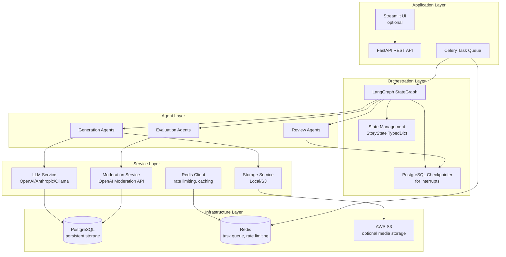
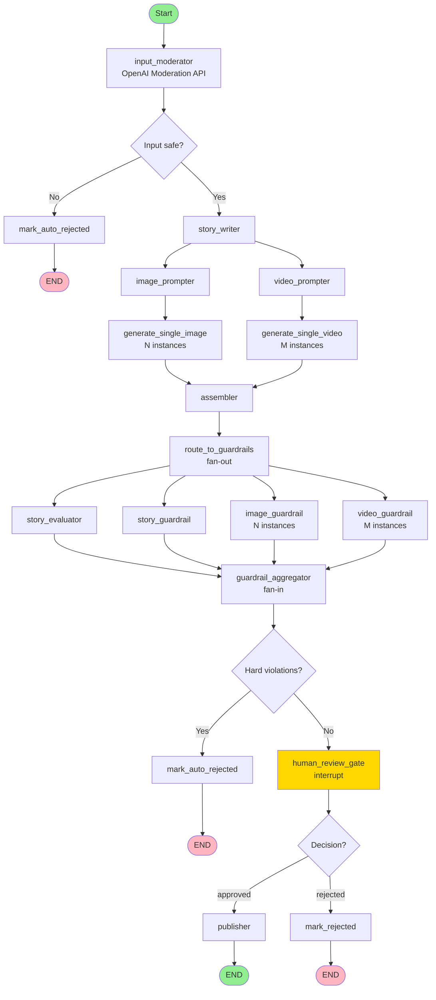

# Architecture Deep Dive

## Overview

Kids Story Agent is built on a **multi-agent orchestration architecture** using LangGraph, combining AI generation, safety guardrails, quality evaluation, and human oversight into a cohesive production system.

## System Architecture

### High-Level Components



## LangGraph Workflow

### Graph Structure

The workflow is organized into **4 distinct phases**:

1. **Input Moderation** (Prevention)
2. **Content Generation** (Parallel Execution)
3. **Evaluation & Guardrails** (Parallel Fan-out)
4. **Human Review & Publishing** (Interrupt-based)

### Complete Workflow Diagram



### Phase 1: Input Moderation

**Node**: `input_moderator`

**Purpose**: Fast pre-filter to reject unsafe prompts before any generation occurs.

**Implementation**:
- Uses OpenAI Moderation API (~50ms latency)
- Checks user prompt for: violence, sexual content, self-harm, hate, harassment
- If blocked → routes to `mark_auto_rejected` (no LLM calls made)
- If safe → proceeds to story generation

**Benefits**:
- Prevents wasted API costs on unsafe content
- Fast rejection (no generation overhead)
- Early safety gate

### Phase 2: Content Generation

**Nodes**:
- `story_writer`: Generates story text using LLM
- `image_prompter`: Creates DALL-E prompts for illustrations
- `video_prompter`: Creates Sora prompts for videos
- `generate_single_image`: DALL-E 3 image generation (×N parallel)
- `generate_single_video`: Sora video generation (×M parallel)
- `assembler`: Validates, sorts, and packages all generated content

**Parallelism Strategy**:

1. **Static Parallelism**: `story_writer` has edges to both `image_prompter` and `video_prompter` → they run simultaneously

2. **Dynamic Fan-out**: Each prompter routes to generators using LangGraph `Send`:
   ```python
   # One Send per image prompt
   for prompt in image_prompts:
       sends.append(Send("generate_single_image", {...}))
   ```

3. **Automatic Fan-in**: All generators have edges to `assembler` → LangGraph waits for all to complete

**State Management**:
- Generator outputs use **reducer fields** (`Annotated[List[str], operator.add]`)
- Multiple parallel `Send` instances each append to the list
- Framework automatically concatenates results

### Phase 3: Evaluation & Guardrails

**Nodes**:
- `story_evaluator`: LLM-based quality scoring (5 dimensions)
- `story_guardrail`: 3-layer text safety checks
- `image_guardrail_with_retry`: Vision-based image safety (×N parallel)
- `video_guardrail_with_retry`: Video prompt + frame sampling (×M parallel)
- `guardrail_aggregator`: Combines all results, makes pass/fail decision

**Parallelism Strategy**:

**Fan-out from `assembler`**:
```python
def route_to_guardrails(state: StoryState) -> list[Send]:
    sends = []
    # Story evaluator
    sends.append(Send("story_evaluator", {...}))
    # Story guardrail
    sends.append(Send("story_guardrail", {...}))
    # Per-image guardrails
    for url in image_urls:
        sends.append(Send("image_guardrail_with_retry", {...}))
    # Per-video guardrails
    for url in video_urls:
        sends.append(Send("video_guardrail_with_retry", {...}))
    return sends
```

**Fan-in to `guardrail_aggregator`**: All guardrail nodes have edges to aggregator → waits for all checks

**Retry Logic**:
- Image/video guardrails check for hard violations
- If found → regenerate once and re-check
- If retry also fails → raises `StoryGenerationError` (fails entire job)

### Phase 4: Human Review & Publishing

**Nodes**:
- `human_review_gate`: LangGraph `interrupt()` pauses execution
- `publisher`: Final persistence after approval
- `mark_rejected`: Handles rejection
- `mark_auto_rejected`: Handles auto-rejection (hard violations)

**Interrupt Mechanism**:

1. **State Checkpointing**: When `interrupt()` is called, LangGraph saves full state to PostgreSQL checkpointer
2. **Graph Pauses**: Execution stops, returns control to caller
3. **Review API**: Exposes pending content via REST endpoints
4. **Resume**: API calls `graph.ainvoke(Command(resume={...}))` with reviewer decision
5. **Graph Continues**: Execution resumes from interrupt point

**State Persistence**:
- Uses `AsyncPostgresSaver` checkpointer
- Thread ID = `job_id` (unique per story generation)
- Full state serialized to PostgreSQL
- Survives server restarts

## State Management

### StoryState TypedDict

The workflow state is defined as a `TypedDict` with reducer annotations:

```python
class StoryState(TypedDict):
    # Input
    job_id: str
    prompt: str
    age_group: str
    num_illustrations: int
    
    # Generation outputs
    story_text: Optional[str]
    story_title: Optional[str]
    image_prompts: List[str]
    video_prompts: List[str]
    
    # Reducer fields (accumulated from parallel Send)
    image_urls: Annotated[List[str], operator.add]
    video_urls: Annotated[List[str], operator.add]
    guardrail_violations: Annotated[List[dict], operator.add]
    
    # Evaluation
    evaluation_scores: Optional[dict]
    guardrail_passed: Optional[bool]
    
    # Review
    review_decision: Optional[str]
    # ... more fields
```

### Reducer Fields

Fields annotated with `Annotated[List[T], operator.add]` are **reducer fields**:
- Multiple parallel `Send` instances each return a list
- LangGraph automatically concatenates all lists
- Used for: `image_urls`, `video_urls`, `guardrail_violations`, `image_urls_final`, `video_urls_final`

## Node Implementation Patterns

### Generator Nodes

**Pattern**: Receive minimal state via `Send`, return accumulated results

```python
async def image_generator_node(state: StoryState) -> dict:
    # Extract runtime keys injected by routing
    prompt = state.get("_current_prompt")
    index = state.get("_current_index")
    
    # Generate image
    image_url = await generate_image(prompt)
    
    # Return reducer-compatible format
    return {
        "image_urls": [image_url],  # Will be concatenated
        "image_metadata": [{...}],
    }
```

### Guardrail Nodes

**Pattern**: Check content, return violations + final media URLs

```python
async def image_guardrail_with_retry_node(state: StoryState) -> dict:
    image_url = state.get("_guardrail_media_url")
    original_prompt = state.get("_guardrail_original_prompt")
    
    # Check safety
    violations = await check_image_safety(image_url)
    hard_violations = [v for v in violations if v["severity"] == "hard"]
    
    if hard_violations:
        # Retry: regenerate
        image_url = await regenerate_image(original_prompt)
        violations = await check_image_safety(image_url)
    
    return {
        "guardrail_violations": violations,  # Reducer field
        "image_urls_final": [{"index": i, "url": image_url}],
    }
```

### Evaluation Nodes

**Pattern**: Use structured LLM outputs, return scores

```python
def story_evaluator_node(state: StoryState) -> dict:
    llm = get_llm()
    structured_llm = llm.with_structured_output(StoryEvalOutput)
    
    output = structured_llm.invoke(messages)
    
    return {
        "evaluation_scores": {
            "moral_score": output.moral_score,
            "theme_appropriateness": output.theme_appropriateness,
            # ... more scores
            "overall_score": compute_weighted_score(output),
        },
        "guardrail_violations": [],  # Evaluator doesn't produce violations
    }
```

## Routing Functions

### Conditional Edges

Routing functions return strings (node names) or lists of `Send`:

```python
def route_after_input_moderation(state: StoryState) -> str:
    if not state.get("input_moderation_passed"):
        return "mark_auto_rejected"
    return "story_writer"

def route_to_image_generators(state: StoryState) -> Union[list[Send], str]:
    sends = []
    for prompt in state.get("image_prompts", []):
        sends.append(Send("generate_single_image", {...}))
    return sends  # LangGraph executes all Send instances in parallel
```

## Checkpointing & Interrupts

### PostgreSQL Checkpointer

**Configuration**:
```python
from langgraph.checkpoint.postgres.aio import AsyncPostgresSaver

async with AsyncPostgresSaver.from_conn_string(conn_string) as checkpointer:
    graph = workflow.compile(checkpointer=checkpointer)
    state = await graph.ainvoke(initial_state, config={"configurable": {"thread_id": job_id}})
```

**Benefits**:
- State survives server restarts
- Multiple workers can resume same job
- Audit trail of state changes
- Required for `interrupt()` to work

### Interrupt Flow

1. **Graph reaches `human_review_gate` node**
2. **Node calls `interrupt(review_package)`**
3. **LangGraph**:
   - Serializes current state
   - Saves to checkpointer
   - Raises `GraphInterrupt` exception
4. **Celery task catches exception**:
   - Updates job status to `pending_review`
   - Persists review package to database
   - Returns (task completes)
5. **Review API**:
   - Lists pending reviews
   - Shows review package
   - Accepts approval/rejection
6. **Resume**:
   ```python
   from langgraph.types import Command
   
   result = await graph.ainvoke(
       Command(resume={
           "decision": "approved",
           "comment": "...",
           "reviewer_id": "..."
       }),
       config={"configurable": {"thread_id": job_id}}
   )
   ```
7. **Graph continues** from interrupt point with reviewer decision

## Error Handling

### StoryGenerationError

Custom exception for recoverable generation failures:
- Guardrail retry exhausted
- API rate limits
- Invalid prompts

**Handling**: Celery task catches, updates job status to `failed`, logs error

### GraphInterrupt

Raised when `interrupt()` is called:
- **Expected**: Part of normal workflow
- **Handling**: Celery task catches, updates status to `pending_review`

### Other Exceptions

- **Unhandled**: Logged with full traceback, job marked `failed`
- **Pydantic Validation**: Caught, converted to error message

## Performance Optimizations

### Parallel Execution

- **Static edges**: Prompter parallelism (image + video prompters)
- **Dynamic Send**: Generator fan-out (N images, M videos in parallel)
- **Guardrail fan-out**: All checks run concurrently

### Async Operations

- **Image generation**: Async HTTP calls to DALL-E
- **Video polling**: Async polling with exponential backoff
- **Database**: Asyncpg driver for non-blocking DB access
- **Storage**: Async S3 uploads

### Caching

- **Redis**: Job status cache (TTL-based)
- **Rate limiting**: Redis-backed distributed rate limiting

## Scalability

### Horizontal Scaling

- **API Servers**: Multiple Gunicorn workers behind load balancer
- **Celery Workers**: Multiple workers processing tasks in parallel
- **Database**: Read replicas for read-heavy operations
- **Redis**: Redis Cluster for high availability

### Vertical Scaling

- **PostgreSQL**: Connection pooling (asyncpg pool)
- **Redis**: Memory optimization for rate limiting cache
- **Celery**: Worker concurrency tuning

## Monitoring Points

### Key Metrics

1. **Workflow Latency**: Time from job creation to completion
2. **Parallel Efficiency**: Actual vs. theoretical speedup
3. **Guardrail Violation Rate**: Percentage of content flagged
4. **Retry Rate**: Percentage of media requiring regeneration
5. **Review Queue Length**: Pending reviews count
6. **API Response Times**: P50, P95, P99 latencies

### Logging

- **Structured logs**: JSON format with job_id, node name, timestamps
- **Log levels**: INFO (workflow progress), WARNING (violations), ERROR (failures)
- **Traceability**: All logs include job_id for end-to-end tracing

## Future Enhancements

### Potential Improvements

1. **Streaming**: Stream story text as it's generated
2. **Partial Results**: Return images as they're generated (don't wait for all)
3. **Caching**: Cache common story patterns to reduce LLM calls
4. **A/B Testing**: Multiple LLM providers, compare outputs
5. **Feedback Loop**: Learn from review decisions to improve prompts
