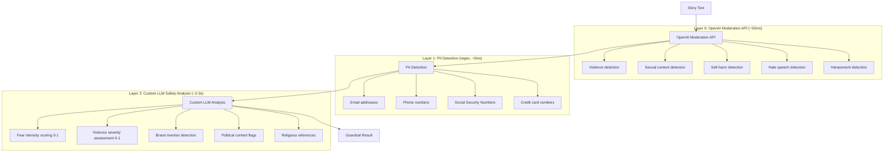
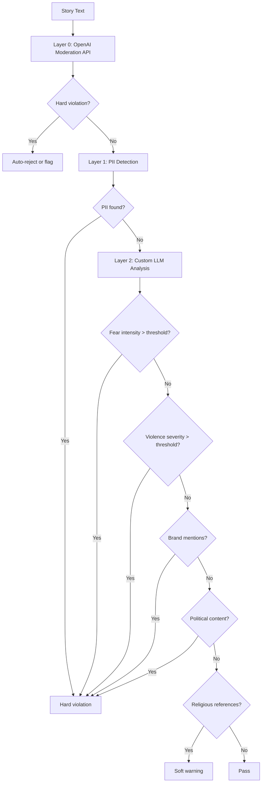
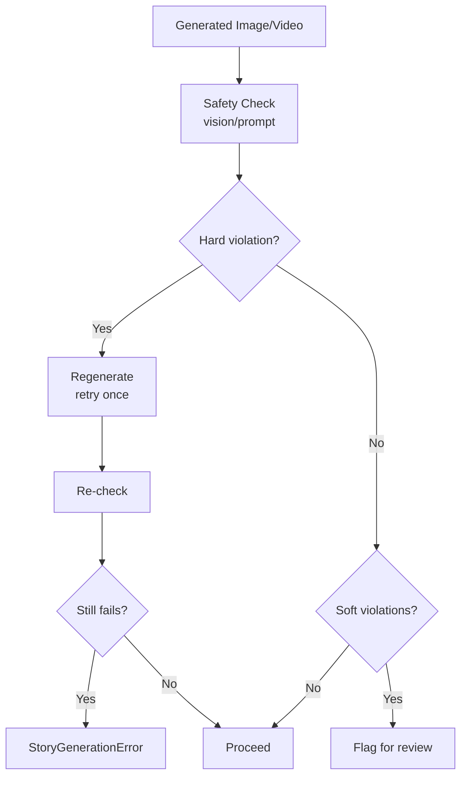

# Guardrails & Safety Framework

## Overview

Kids Story Agent implements a **multi-layer safety framework** that ensures all generated content is safe, age-appropriate, and free from harmful elements. The system uses a combination of fast pre-filters, regex-based detection, and custom LLM analysis to catch issues at multiple stages.

## Architecture

### Three-Layer Text Safety Pipeline



## Layer 0: OpenAI Moderation API

### Purpose

Fast, zero-cost pre-filter that catches obvious violations before expensive LLM calls.

### Implementation

```python
def check_openai_moderation(text: str) -> List[dict]:
    """Check text using OpenAI Moderation API."""
    client = get_openai_client()
    response = client.moderations.create(input=text, model="omni-moderation-latest")
    
    violations = []
    categories = response.results[0].categories
    
    if categories.violence:
        violations.append({
            "severity": "hard",
            "category": "violence",
            "detail": "Violence detected by OpenAI Moderation API",
        })
    # ... check other categories
    
    return violations
```

### Categories Checked

- **Violence**: Physical harm, fighting, weapons, threats
- **Sexual**: Sexual content, nudity, explicit material
- **Self-harm**: Suicide, self-injury, harmful behaviors
- **Hate**: Hate speech, discriminatory content
- **Harassment**: Bullying, threatening language

### Performance

- **Latency**: ~50ms
- **Cost**: Free (no LLM tokens)
- **Accuracy**: High for obvious violations
- **False Positives**: Low (very strict)

### Usage

- **Input Moderation**: Checks user prompt before generation
- **Output Moderation**: Checks generated story text

## Layer 1: PII Detection

### Purpose

Prevents accidental data leakage (emails, phone numbers, etc.) in generated stories.

### Implementation

Uses regex patterns to detect:

```python
PII_PATTERNS = {
    "email": r'\b[A-Za-z0-9._%+-]+@[A-Za-z0-9.-]+\.[A-Z|a-z]{2,}\b',
    "phone": r'\b\d{3}[-.]?\d{3}[-.]?\d{4}\b',
    "ssn": r'\b\d{3}-\d{2}-\d{4}\b',
    "credit_card": r'\b\d{4}[- ]?\d{4}[- ]?\d{4}[- ]?\d{4}\b',
}
```

### Performance

- **Latency**: ~0ms (regex matching)
- **Cost**: Zero
- **Accuracy**: High (pattern-based)
- **False Positives**: Very low

### Violation Format

```python
{
    "severity": "hard",
    "category": "pii_email",
    "detail": "Email address detected: user@example.com",
    "guardrail_name": "pii_detection",
}
```

## Layer 2: Custom LLM Safety Analysis

### Purpose

Domain-specific safety checks tuned for children's content. Catches subtle issues that generic moderation APIs might miss.

### Implementation

Uses structured LLM outputs with custom prompts:

```python
class TextSafetyOutput(BaseModel):
    violence_detected: bool = False
    violence_severity: float = Field(ge=0, le=1)
    fear_intensity: float = Field(ge=0, le=1)
    political_content_detected: bool = False
    brand_mentions_found: List[str] = []
    religious_references_detected: bool = False
    overall_explanation: str = ""
```

### System Prompt

```
You are a children's content safety moderator.
Analyze the text for the following safety concerns:

1. Violence: Any physical harm, fighting, weapons, threats (even fantasy violence)
2. Fear intensity: Scary elements, monsters, dark themes, abandonment, death
3. Political content: Political figures, parties, ideologies, propaganda
4. Brand mentions: Real company/product names (Disney, Nike, McDonald's, etc.)
5. Religious references: Specific religious figures, practices, texts, holidays

Score violence_severity and fear_intensity from 0.0 (none) to 1.0 (extreme).
Be thorough — this content is for children aged {age_group}.
If something is borderline, err on the side of caution and flag it.
```

### Checks Performed

#### 1. Violence Severity

- **Score Range**: 0.0 (none) to 1.0 (extreme)
- **Hard Threshold**: `GUARDRAIL_VIOLENCE_HARD_THRESHOLD` (default: 0.6)
- **Soft Threshold**: Below hard threshold but > 0.0

**Examples**:
- 0.0: No violence
- 0.3: Mild conflict (arguing)
- 0.6: Moderate violence (fighting, weapons)
- 0.9: Severe violence (graphic harm)

#### 2. Fear Intensity

- **Score Range**: 0.0 (none) to 1.0 (extreme)
- **Hard Threshold**: `GUARDRAIL_FEAR_THRESHOLD` (default: 0.4)
- **Age-Specific**: Lower thresholds for younger age groups

**Examples**:
- 0.0: No scary elements
- 0.2: Mild suspense
- 0.4: Moderate fear (monsters, darkness)
- 0.8: Severe fear (horror, death)

#### 3. Brand Mentions

- **Detection**: List of brand names found
- **Severity**: Hard violation (commercial content not allowed)

**Examples**:
- "Disney", "Nike", "McDonald's", "Coca-Cola"

#### 4. Political Content

- **Detection**: Boolean flag
- **Detail**: Explanation of political content found
- **Severity**: Hard violation

**Examples**:
- Political figures, parties, ideologies, propaganda

#### 5. Religious References

- **Detection**: Boolean flag
- **Detail**: Explanation of religious content found
- **Severity**: Soft warning (may be acceptable in some contexts)

**Examples**:
- Specific religious figures, practices, texts, holidays

### Performance

- **Latency**: ~2-3 seconds (LLM call)
- **Cost**: ~1000-2000 tokens per check
- **Accuracy**: High (domain-specific)
- **False Positives**: Moderate (conservative by design)

## Media Guardrails

### Image Safety

**Implementation**: Vision-based LLM analysis

```python
class ImageSafetyOutput(BaseModel):
    nsfw_detected: bool = False
    nsfw_confidence: float = Field(ge=0, le=1)
    weapon_detected: bool = False
    weapon_confidence: float = Field(ge=0, le=1)
    realistic_human_child: bool = False
    realistic_child_confidence: float = Field(ge=0, le=1)
    horror_elements: bool = False
    horror_confidence: float = Field(ge=0, le=1)
    is_safe_for_children: bool = True
```

**Checks**:
1. **NSFW Content**: Nudity, sexual content, graphic material
2. **Weapons**: Guns, knives, swords, bombs, any weapons
3. **Realistic Children**: Photorealistic depictions of real children (safety concern)
4. **Horror Elements**: Gore, blood, skeletons, scary monsters

**Retry Logic**:
- If hard violation detected → regenerate image once
- Re-check regenerated image
- If still fails → raise `StoryGenerationError`

### Video Safety

**Implementation**: Prompt moderation + optional frame sampling

**Checks**:
1. **Prompt Moderation**: Check Sora prompt using text guardrails
2. **Frame Sampling** (optional): Extract frames, check each with vision model

**Retry Logic**:
- If hard violation detected → regenerate video once
- Re-check regenerated video
- If still fails → raise `StoryGenerationError`

## Guardrail Aggregation

### Aggregator Node

Combines results from all guardrail checks:

```python
def guardrail_aggregator_node(state: StoryState) -> dict:
    violations = state.get("guardrail_violations", [])
    hard_violations = [v for v in violations if v["severity"] == "hard"]
    
    guardrail_passed = len(hard_violations) == 0
    
    return {
        "guardrail_passed": guardrail_passed,
        "guardrail_summary": build_summary(violations),
    }
```

### Decision Logic

1. **Hard Violations Present**:
   - If `GUARDRAIL_AUTO_REJECT_ON_HARD_FAIL=true` → auto-reject (skip human review)
   - Otherwise → proceed to human review (with violations flagged)

2. **Only Soft Violations**:
   - Proceed to human review (warnings shown)

3. **No Violations**:
   - Proceed to human review (clean content)

## Violation Severity Levels

### Hard Violations

**Definition**: Content that must be rejected or regenerated.

**Examples**:
- Violence severity > threshold
- Fear intensity > threshold
- NSFW content detected
- Weapons detected
- Brand mentions
- Political content
- PII detected

**Handling**:
- Auto-reject (if enabled)
- Or flag for human review
- Media: Trigger regeneration

### Soft Violations

**Definition**: Content that may be acceptable but should be reviewed.

**Examples**:
- Mild fear elements (below threshold)
- Religious references (context-dependent)
- Borderline violence (below threshold)

**Handling**:
- Proceed to human review
- Show warnings in review package
- Human reviewer makes final decision

## Configuration

### Environment Variables

```env
# Fear threshold (0-1)
GUARDRAIL_FEAR_THRESHOLD=0.4

# Violence hard threshold (0-1)
GUARDRAIL_VIOLENCE_HARD_THRESHOLD=0.6

# Max regeneration retries per media item
MEDIA_GUARDRAIL_MAX_RETRIES=1

# Auto-reject on hard violations (skip human review)
GUARDRAIL_AUTO_REJECT_ON_HARD_FAIL=true

# Enable OpenAI Moderation API
ENABLE_OPENAI_MODERATION=true

# Video frame sampling
VIDEO_FRAME_SAMPLING_ENABLED=true
VIDEO_SAMPLE_FRAMES=5
```

### Age Group Tuning

Different thresholds for different age groups:

- **3-5 years**: Lower fear threshold (0.3), stricter violence checks
- **6-8 years**: Moderate thresholds (defaults)
- **9-12 years**: Higher thresholds (0.5 fear, 0.7 violence)

## Violation Response Flow

### Text Guardrails



### Media Guardrails



## Best Practices

### Tuning Thresholds

1. **Start Conservative**: Lower thresholds catch more issues
2. **Monitor False Positives**: Adjust based on review feedback
3. **Age-Specific Tuning**: Different thresholds per age group
4. **A/B Testing**: Test threshold changes on sample content

### Handling Edge Cases

1. **Fantasy Violence**: May be acceptable in context (e.g., superhero stories)
2. **Educational Content**: Political/religious content may be educational
3. **Cultural Sensitivity**: Consider cultural context for religious references

### Performance Optimization

1. **Layer 0 First**: Fast OpenAI Moderation API catches most issues
2. **Early Exit**: Stop checking if hard violation found
3. **Parallel Checks**: All guardrails run concurrently
4. **Caching**: Cache moderation results for identical content

## Monitoring

### Key Metrics

- **Violation Rate**: Percentage of content flagged
- **Hard vs. Soft**: Ratio of hard to soft violations
- **Retry Rate**: Percentage of media requiring regeneration
- **False Positive Rate**: Content incorrectly flagged
- **Layer Performance**: Latency and accuracy per layer

### Logging

All guardrail checks are logged with:
- Job ID
- Layer name
- Violation details
- Severity level
- Timestamp

Example log:
```
WARNING: Job abc123: [L2-LLM] FLAGGED — fear_intensity=0.5 (threshold=0.4), violence_severity=0.3
```

## Future Enhancements

### Potential Improvements

1. **Learning from Reviews**: Adjust thresholds based on human review decisions
2. **Custom Brand Lists**: Configurable lists of allowed/disallowed brands
3. **Contextual Analysis**: Consider story context when evaluating violations
4. **Multi-Language Support**: Extend PII detection to other languages
5. **Real-Time Updates**: Update thresholds without code changes
