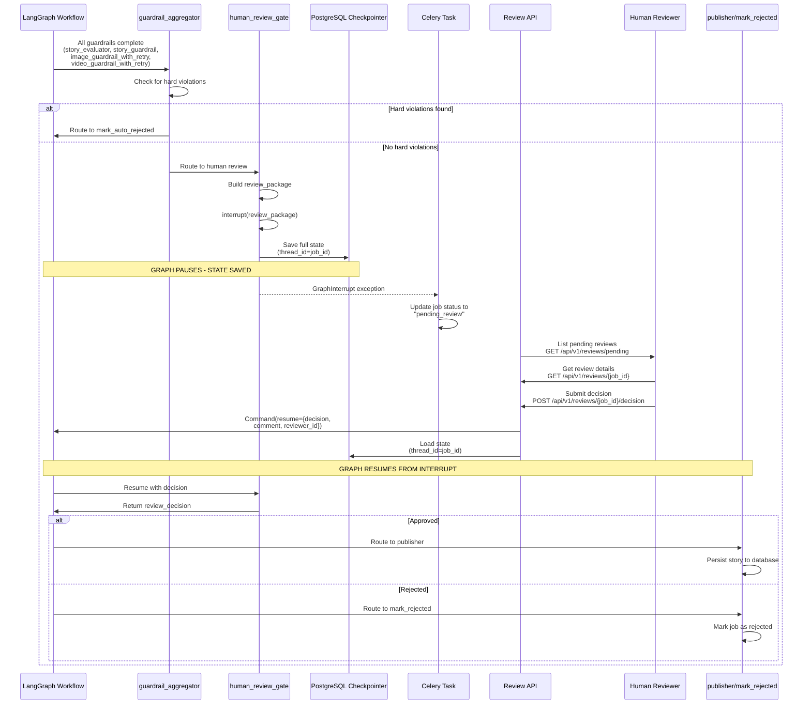

# Human-in-the-Loop Review System

## Overview

Kids Story Agent implements a **seamless human-in-the-loop review system** using LangGraph's interrupt mechanism. This allows human reviewers to inspect, approve, or reject generated content before it's published, ensuring quality and safety standards are met.

## Architecture

### Interrupt-Based Workflow



## How It Works

### 1. Graph Execution

When the workflow reaches the `human_review_gate` node:

```python
def human_review_gate_node(state: StoryState) -> dict:
    # Build review package
    review_package = {
        "job_id": job_id,
        "story_title": state.get("story_title"),
        "story_text": state.get("story_text"),
        "evaluation_scores": state.get("evaluation_scores"),
        "guardrail_violations": state.get("guardrail_violations", []),
        "image_urls": state.get("image_urls", []),
        "video_urls": state.get("video_urls", []),
    }
    
    # GRAPH PAUSES HERE
    decision = interrupt(review_package)
    
    # Resumes here when Command(resume=...) is called
    return {
        "review_decision": decision.get("decision"),
        "review_comment": decision.get("comment"),
        "reviewer_id": decision.get("reviewer_id"),
    }
```

### 2. State Checkpointing

When `interrupt()` is called:
- **Full state serialized** to PostgreSQL checkpointer
- **Thread ID** = `job_id` (unique per story)
- **State persists** across server restarts
- **Multiple workers** can resume same job

### 3. Celery Task Handling

The Celery task catches `GraphInterrupt`:

```python
try:
    final_state = await run_story_generation(initial_state, thread_id=job_id)
except GraphInterrupt:
    # Graph was interrupted for human review
    _persist_pre_review_data(job_id, final_state)
    update_job_status(job_id, "pending_review")
    return {"job_id": job_id, "status": "pending_review"}
```

### 4. Review API

Reviewers interact via REST API:

```bash
# List pending reviews
GET /api/v1/reviews/pending

# Get review details
GET /api/v1/reviews/{job_id}

# Submit decision
POST /api/v1/reviews/{job_id}/decision
{
  "decision": "approved",
  "comment": "Looks great!",
  "reviewer_id": "reviewer_123"
}
```

### 5. Graph Resume

The API resumes the graph:

```python
from langgraph.types import Command

result = await graph.ainvoke(
    Command(resume={
        "decision": "approved",
        "comment": "Looks great!",
        "reviewer_id": "reviewer_123"
    }),
    config={"configurable": {"thread_id": job_id}}
)
```

### 6. Final Processing

Graph continues from interrupt point:
- **Approved** → routes to `publisher` → final persistence
- **Rejected** → routes to `mark_rejected` → job marked as rejected

## Review Package

### Contents

The review package includes all information needed for human review:

```json
{
  "job_id": "550e8400-e29b-41d4-a716-446655440000",
  "story_title": "The Brave Little Mouse",
  "story_text": "Once upon a time...",
  "age_group": "6-8",
  "evaluation_scores": {
    "overall_score": 8.05,
    "moral_score": 8.0,
    "theme_appropriateness": 7.5,
    "emotional_positivity": 9.0,
    "age_appropriateness": 8.5,
    "educational_value": 6.0,
    "evaluation_summary": "This story effectively teaches..."
  },
  "guardrail_passed": true,
  "guardrail_summary": "All guardrails passed. No violations detected.",
  "guardrail_violations": [],
  "image_urls": [
    "https://storage.example.com/images/story-123/image-1.png",
    "https://storage.example.com/images/story-123/image-2.png"
  ],
  "video_urls": [
    "https://storage.example.com/videos/story-123/video-1.mp4"
  ]
}
```

### Review Package Fields

- **job_id**: Unique identifier for the story generation job
- **story_title**: Generated story title
- **story_text**: Full story text
- **age_group**: Target age group (3-5, 6-8, 9-12)
- **evaluation_scores**: Quality scores across 5 dimensions
- **guardrail_passed**: Boolean indicating if guardrails passed
- **guardrail_summary**: Human-readable summary of guardrail results
- **guardrail_violations**: List of any violations detected (empty if passed)
- **image_urls**: URLs to generated images
- **video_urls**: URLs to generated videos

## API Endpoints

### List Pending Reviews

```http
GET /api/v1/reviews/pending
Authorization: Bearer {api_key}
```

**Response**:
```json
{
  "pending_reviews": [
    {
      "job_id": "550e8400-e29b-41d4-a716-446655440000",
      "created_at": "2024-01-15T10:30:00Z",
      "age_group": "6-8",
      "overall_score": 8.05,
      "guardrail_passed": true
    }
  ],
  "total": 1
}
```

### Get Review Details

```http
GET /api/v1/reviews/{job_id}
Authorization: Bearer {api_key}
```

**Response**: Full review package (see above)

### Submit Review Decision

```http
POST /api/v1/reviews/{job_id}/decision
Authorization: Bearer {api_key}
Content-Type: application/json

{
  "decision": "approved",
  "comment": "Looks great! Approved for publication.",
  "reviewer_id": "reviewer_123"
}
```

**Request Body**:
- **decision**: `"approved"` or `"rejected"` (required)
- **comment**: Optional comment explaining decision
- **reviewer_id**: Identifier for the reviewer (optional)

**Response**:
```json
{
  "job_id": "550e8400-e29b-41d4-a716-446655440000",
  "status": "processing",
  "message": "Review decision submitted. Story generation will continue."
}
```

## Timeout Handling

### Auto-Rejection

If a review is not completed within the configured timeout:

```env
REVIEW_TIMEOUT_DAYS=3
```

A background Celery task automatically rejects pending reviews:

```python
@celery_app.task
def review_timeout_task():
    """Auto-reject reviews older than REVIEW_TIMEOUT_DAYS."""
    cutoff_date = datetime.utcnow() - timedelta(days=settings.review_timeout_days)
    
    pending_reviews = get_pending_reviews_older_than(cutoff_date)
    
    for review in pending_reviews:
        # Resume graph with rejection decision
        await graph.ainvoke(
            Command(resume={
                "decision": "rejected",
                "comment": "Auto-rejected due to timeout",
                "reviewer_id": "system"
            }),
            config={"configurable": {"thread_id": review.job_id}}
        )
```

### Configuration

- **REVIEW_TIMEOUT_DAYS**: Days before auto-rejection (default: 3)
- **REVIEW_TIMEOUT_TASK_INTERVAL**: How often to check for timeouts (default: hourly)

## Review Workflow

### Typical Review Process

1. **Story Generated**: Workflow completes generation, evaluation, guardrails
2. **Graph Interrupts**: State saved, job status = `pending_review`
3. **Reviewer Notified**: Email, webhook, or dashboard notification
4. **Reviewer Accesses**: Uses review API to view pending content
5. **Reviewer Decides**: Approves or rejects with optional comment
6. **Graph Resumes**: Workflow continues based on decision
7. **Final Processing**: Story published or rejected

### Review Decision Criteria

**Approve if**:
- Overall evaluation score ≥ 7.0
- No hard guardrail violations
- Content is age-appropriate
- Images/videos are safe and relevant

**Reject if**:
- Overall evaluation score < 5.0
- Hard guardrail violations present
- Content is inappropriate for age group
- Images/videos are unsafe or irrelevant

**Review Carefully if**:
- Overall score 5.0-6.9
- Soft guardrail violations present
- Borderline age-appropriateness

## State Persistence

### PostgreSQL Checkpointer

Uses LangGraph's `AsyncPostgresSaver`:

```python
from langgraph.checkpoint.postgres.aio import AsyncPostgresSaver

async with AsyncPostgresSaver.from_conn_string(conn_string) as checkpointer:
    graph = workflow.compile(checkpointer=checkpointer)
    state = await graph.ainvoke(initial_state, config={
        "configurable": {"thread_id": job_id}
    })
```

### State Recovery

If a server restarts:
- **State preserved** in PostgreSQL
- **Graph can resume** from interrupt point
- **No data loss** during review period

### Thread ID

- **Thread ID = Job ID**: Unique identifier per story generation
- **Multiple Interrupts**: Same thread ID allows resuming same job
- **Isolation**: Different jobs use different thread IDs

## Error Handling

### Review API Errors

- **Job Not Found**: 404 if job_id doesn't exist
- **Already Reviewed**: 400 if decision already submitted
- **Invalid Decision**: 400 if decision is not "approved" or "rejected"
- **Graph Resume Failure**: 500 if graph resume fails

### Graph Resume Errors

- **State Not Found**: Checkpointer can't find saved state
- **Invalid State**: State corrupted or incompatible
- **Resume Failure**: Error during graph execution after resume

**Handling**: Log errors, update job status to `failed`, notify administrators

## Best Practices

### Review Interface

1. **Display All Information**: Show evaluation scores, guardrail results, media
2. **Side-by-Side Comparison**: Compare story text with images/videos
3. **Quick Actions**: One-click approve/reject buttons
4. **Comment Field**: Optional comment for feedback
5. **History**: Show previous review decisions for learning

### Review Queue Management

1. **Priority Queue**: Sort by creation date, score, or urgency
2. **Batch Review**: Review multiple stories at once
3. **Filtering**: Filter by age group, score range, guardrail status
4. **Search**: Search by job_id, story title, or content

### Reviewer Training

1. **Guidelines**: Clear guidelines on when to approve/reject
2. **Examples**: Show examples of approved/rejected content
3. **Feedback**: Regular feedback on review quality
4. **Calibration**: Compare reviewer decisions to ensure consistency

## Monitoring

### Key Metrics

- **Pending Review Count**: Number of stories awaiting review
- **Average Review Time**: Time from generation to decision
- **Approval Rate**: Percentage of stories approved
- **Timeout Rate**: Percentage of reviews auto-rejected
- **Reviewer Activity**: Reviews per reviewer per day

### Logging

All review actions are logged:

```
INFO: Job abc123: Human review decision received — decision=approved, reviewer=reviewer_123
INFO: Job abc123: Graph resumed after human review
INFO: Job abc123: Story published successfully
```

## Future Enhancements

### Potential Improvements

1. **Reviewer Assignment**: Assign reviews to specific reviewers
2. **Reviewer Ratings**: Rate reviewer quality and consistency
3. **Automated Pre-Review**: Pre-filter obvious approvals/rejections
4. **Reviewer Dashboard**: Web UI for reviewing content
5. **Review Analytics**: Track review patterns and trends
6. **Multi-Stage Review**: Multiple reviewers for high-stakes content
7. **Review Feedback Loop**: Learn from review decisions to improve generation
